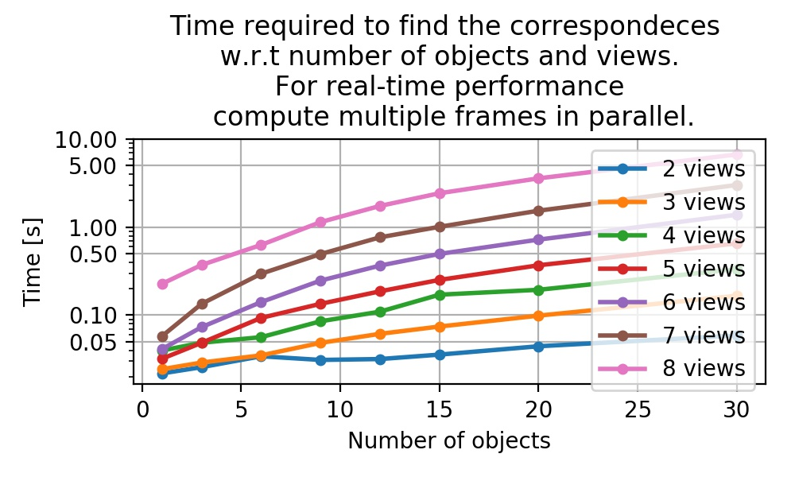

# Blind matching of detections across multiple views using epipolar geometry and Integer Linear Programming (ILP).

This method blindly finds the set of correspondeces between multiple detections of the same objects acquire from multiple calibrated cameras.
We leverge the epipolar geometry to find candidtaes matches betwene pair of views and Integer Linear Programming (ILP) to find the optimal solution considering all views.

## Prerequisites

- numpy
- scipy
- imageio
- OpenCV

## Installation
```
export PYTHONPATH="...parent folder...:$PYTHONPATH"
```

## Usage

#### Compute intrinsic and extrinsics parameters of the cameras:
Have a look at the [multiview_calib](https://github.com/cvlab-epfl/multiview_calib) repository.

#### Find the correspondeces

Have a look at the example!

## Benchmark



## License

